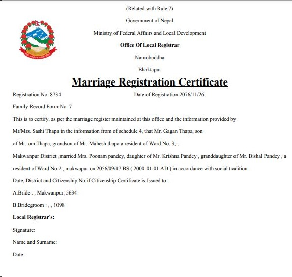
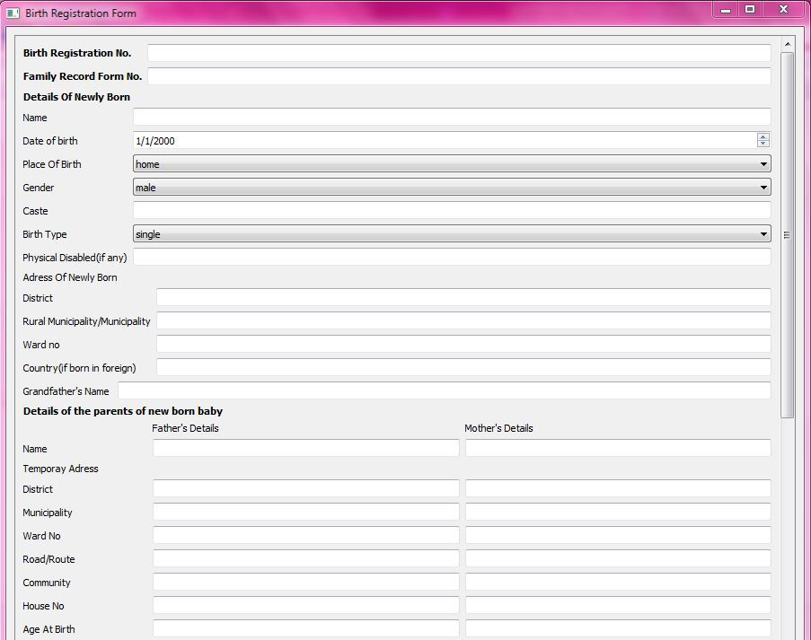

# Smartward (Smartवडा)

## Introduction

***Smartward*** or ***Smartवडा*** is a desktop application built using PyQt5 technology. It aims to help local ward offices in Nepal to automate their tasks using technology.

## Getting Started

Prepare the environment using:

```
python3 -m venv venv
source venv/bin/activate
pip3 install -r requirements.txt
```

Run the app using:
```
python3 main.py
```

## Screenshots





## Developers
- [Shrawak Bhattarai](https://github.com/Shrawak)
- [Ramraj Chimouriya](https://github.com/RamrajCh)
- [Deependra Kumar Gupta](https://github.com/Deependra12)
- [Shreyam Pokharel](https://github.com/pshreyam)
